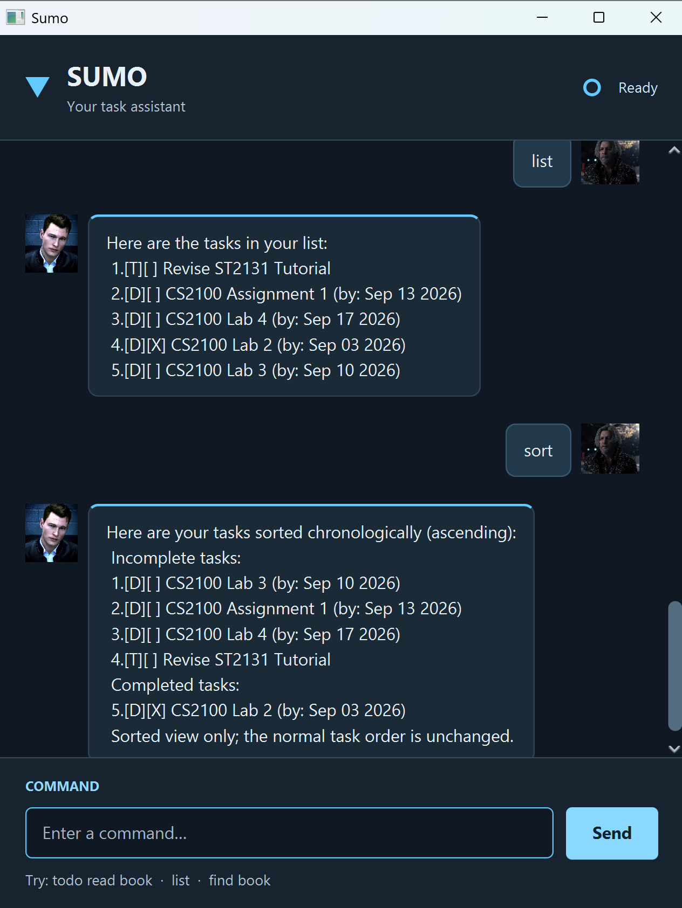

# Sumo User Guide

Keep assignments, errands, and appointments in one conversation. Sumo lets you add tasks,
check what's coming up, and mark work complete by typing short commands. Your task list is
saved automatically, ready for your next session.



## In this guide

- [Getting started](#getting-started)
- [Command basics](#command-basics)
- [Features](#features)
- [Saving your tasks](#saving-your-tasks)
- [Troubleshooting](#troubleshooting)
- [Command reference](#command-reference)

## Getting started

1. Install **Java 25**. Open a terminal (PowerShell on Windows, or Terminal on macOS/Linux)
   and check that it uses version 25:

   ```shell
   java -version
   ```

2. Download **Sumo.jar** from the Assets section of the
   [latest Sumo release](https://github.com/Kenneth-Chia/ip/releases/latest).
   Choose the `.jar` file rather than the source code ZIP or TAR.GZ.
3. Put the JAR in a folder where you want to keep Sumo and its task data. You must be able
   to create and edit files in this folder.
4. Open a terminal in that folder and launch the app:

   ```shell
   java -jar Sumo.jar
   ```

   If you saved the download under another name, replace `Sumo.jar` with that filename.
   The Sumo chat window shown above should open. The release JAR bundles the app's dependencies;
   you do not need IntelliJ or Gradle to use it.
5. Type the following commands into the box at the bottom of the **Sumo window**, one at a time.
   Press **Enter** or click **Send** after each command:

   ```text
   todo read a book
   deadline submit report /by 2026-09-20 1700
   list
   mark 1
   ```

On a fresh task list, this creates two tasks and marks `read a book` complete.
For later sessions, run the same launch command from the same folder to reload your tasks.

## Command basics

- Commands are **case-sensitive**: use `list`, not `List`. Enter one command at a time.
- Replace uppercase placeholders such as `DESCRIPTION` with your own text.
- Dates use `yyyy-MM-dd` or `d/M/yyyy`, for example `2026-09-20` or `20/9/2026`.
- Optional times use four-digit, 24-hour `HHmm`: `0915` means 9:15 am. An omitted time means midnight.
  Square brackets in command formats indicate optional input; do not type the brackets.
- Descriptions cannot be blank or contain `|`, line breaks, or control characters.
  Extra spaces are reduced to single spaces.

## Features

### Add a todo: `todo`

Use a todo for something without a date.

**Format:** `todo DESCRIPTION`

```text
todo read a book
```

Sumo adds an incomplete task and shows the new task count. If this is your first task, the reply is:

```text
Understood. I've added this task:
  [T][ ] read a book
Now you have 1 tasks in the list.
```

### Add a deadline: `deadline`

Use a deadline for something that must be done by a date, optionally with a time.

**Format:** `deadline DESCRIPTION /by DATE [HHmm]`

```text
deadline submit report /by 2026-09-20
deadline pay fees /by 21/9/2026 1700
```

The first example is due on 20 September 2026; the second is due at 5 pm on 21 September 2026.
Sumo confirms each addition and displays its due date, including the time when supplied.

### Add an event: `event`

Use an event for something with a start and end.

**Format:** `event DESCRIPTION /from DATE [HHmm] /to DATE [HHmm]`

```text
event project meeting /from 2026-09-20 1400 /to 2026-09-20 1600
event study camp /from 2026-09-22 /to 2026-09-24
```

The meeting runs from 2 pm to 4 pm. The camp demonstrates an event spanning several dates.
The end must be after the start. For a same-day event, include an end time later than the start.
Use each parameter (`/by`, or `/from` and `/to`) exactly once in the order shown.
Other words starting with `/` are reserved in deadline and event commands.

**Duplicate tasks:** Sumo rejects tasks with the same type, description, and dates/times, even if
capitalization, spacing, or completion status differs. A date without a time equals that date at
`0000`. Give recurring tasks different dates or descriptions.

### View all tasks: `list`

Enter `list` to see all tasks in the order you added them, including completed tasks. For example:

```text
Here are the tasks in your list:
 1.[T][ ] read a book
 2.[D][X] submit report (by: Sep 20 2026)
```

`[T]` means todo, `[D]` deadline, and `[E]` event. `[ ]` means incomplete; `[X]` means completed.

### Complete or reopen a task: `mark` / `unmark`

**Formats:** `mark NUMBER` and `unmark NUMBER`

Use `mark 1` to complete the first task, or `unmark 1` to make it incomplete again.
Sumo shows the task with its updated status.

> **Always use the task number from `list`** for `mark`, `unmark`, and `delete`.
> Results from `find`, `on`, and `sort` have their own display numbering. Run `list` again before
> changing a task so you select the right one.

### Delete a task: `delete`

**Format:** `delete NUMBER`

Use `delete 1` to remove the first task. Sumo shows the removed task and remaining count.
Deletion has no undo command, and later task numbers shift up. Run `list` before your next change.

### Find tasks by description: `find`

**Format:** `find TEXT`

Use `find book` to show descriptions containing `book`, including `read a book` and `buy books`.
Matching is case-sensitive: `Book` does not match `book`. Multiple words are matched as one phrase.
If nothing matches, only the results heading appears.

### View tasks on a date: `on`

**Format:** `on DATE`

Use `on 2026-09-20` to see deadlines due that day and events spanning that day, including their
start and end dates. Todos are excluded; completed tasks are included. If nothing matches, only
the results heading appears.

### View tasks chronologically: `sort`

Enter `sort` for a temporary view grouped into incomplete tasks first, then completed tasks.
Within each group:

- Deadlines are ordered by due date/time and events by end date/time, earliest first.
- Events with the same end are ordered by start; other ties keep their existing order.
- Undated todos appear last.

Sorting does not change the saved order or the numbers used to update tasks. Use `list` to return
to the normal view. An empty list produces `No tasks to be sorted.`

### End your session: `bye`

Enter `bye` to end the session. In the chat window, input is disabled and you can close the window;
reopen Sumo to start another session.

`list`, `sort`, and `bye` take no extra arguments.

## Saving your tasks

Tasks are saved automatically after each successful addition, deletion, or status change to
`data/sumo.txt`, relative to the folder Sumo was launched from. Launch from the same folder each time
to load the same tasks. You do not need a save command.

The first successful task change creates the data file if it does not exist. To back up your list,
close Sumo and copy `data/sumo.txt` to a safe location. If you move Sumo to another folder, move
the `data` folder with it to keep your saved tasks.

## Troubleshooting

- **`java` is not recognised, or the JAR reports a newer Java version is needed?** Install Java 25,
  reopen the terminal, and check `java -version` before launching again.
- **`Unable to access jarfile Sumo.jar`?** Open the terminal in the folder containing the download
  and check that the filename in your command matches the file, including its `.jar` extension.
- **Your tasks seem to have disappeared?** Check that you launched from your usual folder and
  that its `data/sumo.txt` is still there.
- **Command rejected?** Check the spelling, required description, date/time format, and parameter order.
  Task numbers must be positive whole numbers from `list`.
- **Saving failed?** The attempted change is rolled back. Check the error and that the data folder is
  writable. If the file was changed outside Sumo, restart to load it before trying again.
- **Saved-data warning on startup?** Sumo preserves the original file and disables saving; valid records
  remain viewable when possible. Back up `data/sumo.txt`, repair the reported lines or file permissions,
  and restart Sumo.

## Command reference

Use this table when you need a reminder. Replace uppercase words with your values;
`[HHmm]` is an optional time.

| Action | Command format |
| --- | --- |
| Add an undated task | `todo DESCRIPTION` |
| Add a due date | `deadline DESCRIPTION /by DATE [HHmm]` |
| Add a scheduled activity | `event DESCRIPTION /from DATE [HHmm] /to DATE [HHmm]` |
| Show the full list | `list` |
| Mark complete | `mark NUMBER` |
| Mark incomplete | `unmark NUMBER` |
| Remove a task | `delete NUMBER` |
| Search descriptions | `find TEXT` |
| Check a date | `on DATE` |
| Show tasks chronologically | `sort` |
| End the chat | `bye` |

Remember: take `NUMBER` from `list`, even if your most recent view was a search or sorted result.
